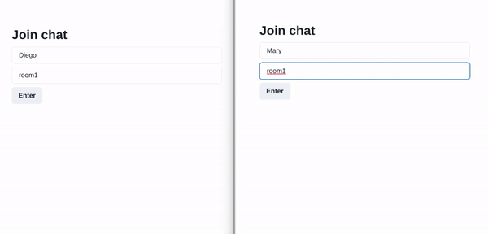

# simple_chatroom_app
Simple realtime chat room app with socket.io server and Next.js client.

### Get Started

<h4>Run server</h4>
<code>~ cd server</code> 
<code>yarn dev</code>

<h4>Run client</h4>
<code>~ cd server</code> 
<code>yarn dev</code>

  

